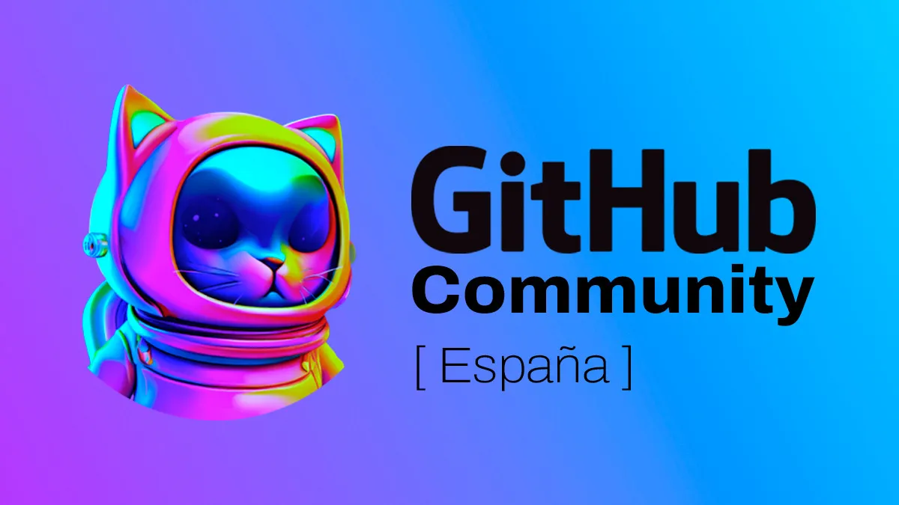

# GitHub Community Spain

## Nuestra Comunidad

### Filosofía

- **Compartir, aprender y colaborar** con personas de intereses y objetivos comunes en el ámbito tecnológico.
- **Ayudar** a personas que inician en el mundo de la tecnología y la programación a través de charlas, y eventos.
- Crear un espacio **abierto, inclusivo, diverso** y seguro para que todas las personas puedan participar.
- Fomentar la iniciación y la participación en **proyectos de código abierto**.

### Motivación

- **Altruista y generosa**: Sin beneficios monetarios.
- **Aportar valor** a la sociedad y al sector tecnológico.
- **Dar voz** a todo tipo de personas, expertas y referentes, pero también iniciadas y emergentes.

### Organización

- **Abierta y participativa**: Cualquier persona puede colaborar.
- Expandir la red por diferentes **lugares y ciudades de España**.
- **Respetar** a todos los miembros y seguir el código de conducta.

### Enfoque en GitHub

- Nuestra comunidad se basa en todo lo que rodea **GitHub**.
- Reconocemos el valor de GitHub como herramienta y como filosofía de trabajo.

### Cultura de Conocimiento

- Aprendizaje continuo, curiosidad y experimentación.
- Involucrar a todos en el proceso de enseñar y aprender.

### Proyección Futura

Nuestra comunidad se proyecta hacia el futuro con **optimismo y responsabilidad**. Somos conscientes de los retos y las oportunidades que nos ofrece la tecnología. Queremos contribuir al desarrollo **sostenible, ético e inclusivo** de nuestra sociedad con nuestro trabajo.

---

Este es nuestro **manifiesto**. Esta es nuestra **comunidad**. Esta es **GitHub Community Spain**.
